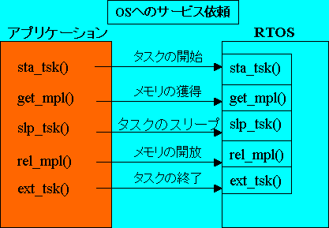
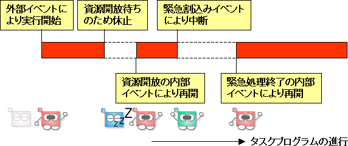
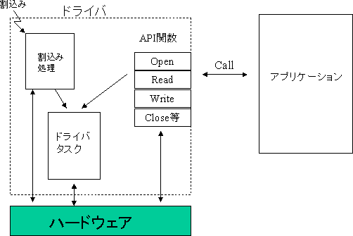
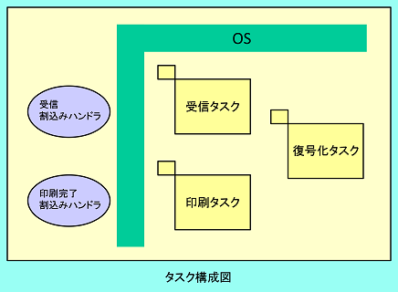
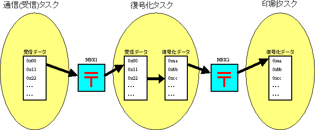
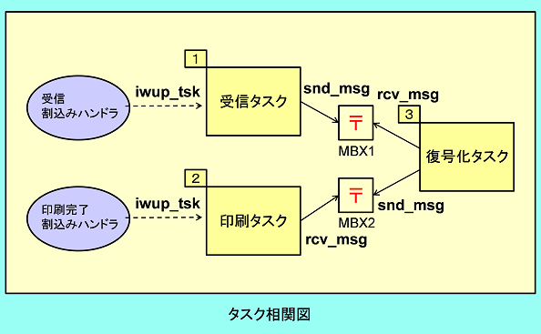
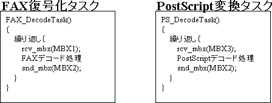

# 組込みシステム

## リアルタイムOSの仕組み（続き）

### リアルタイムOSの機能

リアルタイムOSは前回説明したスケジューリング以外にも多くの機能を提供している。

- タスク管理：タスクの状態を参照、操作する  
  例：タスクの起動／終了  
- タスク付属同期：タスクの状態を操作してタスク間の同期をとる  
  例：起床／起床待ち  
- 同期・通信：以下のような待ち合わせ機構と通信手段がある  
  セマフォ：タスク間の待ち合わせ機構。主に共有資源の待ち合わせに利用  
  イベントフラグ：タスク間の待ち合わせ機構。処理の完了などを通知する場合に利用  
  メールボックス：タスク間のデータの送受信と待ち合わせ機構。メッセージ通信に利用  
- メモリプール：タスクが必要とするメモリの提供、解放を行う

他にもデータキュー、メッセージバッファ、タスク例外処理、時間管理、割り込み管理、システム状態管理、サービスコール管理、システム構成管理などの機能がある。  
これらの機能をシステムに組み込むために個別のサービスコールが用意されている。

### リアルタイムOSを組み込むことによって生じるマイナス面

- OSがメモリ領域を占有する  
  OSは実行プログラムの一部としてメモリ領域に組み込まれるために、OS分のメモリサイズを確保する必要がある。  
  OSのメモリサイズはOSの機能をどこまで使用するか、タスクや待ち要因の待ち行列をどれだけ用意するかによって異なる。  
- OSの内部処理に時間をとられる  
  タスクがサービスコールを発行して、OSが処理し必要に応じてタスクを切り替えるには時間を要する。  
  必要な機能処理時間は依頼されたサービスに応じて異なる。  
  メールボックスによるタスク間通信のような複雑な処理ほど時間がかかる。  
  スケジューラ処理からディスパッチまでの時間はタスクの切り替えのために必要な時間で、特にこれをタスクスイッチ時間と呼んでいる。  
- OSが割り込みを禁止する
  OSの内部処理中に割り込み信号が入って別のプログラムが起動されると困る場合がある。  
  OSはその処理区間を組込み禁止にする命令をCPUに与え問題を回避している。  
  これをOSによる割り込み禁止時間と呼ぶ。

OSが介在することによって生ずるこれらのシステム全体に共通な負担のことをOSのオーバヘッドという。  
OSの性能はこれらのオーバヘッドをいかに小さくするかにかかっている。

## リアルタイムOS下でのプログラミングスタイル

### サービスコール型プログラミング

#### サービスコールとは？

OSの持つ機能を要求するときに使うコマンドのこと（≒システムコール）。  
コマンドには相手先を指定したり、時間などの値を指定する。  
コマンドに応じて指定するものが異なる。

#### サービスコール型プログラミングとは？

OSの機能をコマンドで要求しながら処理を行うプログラミング方式。  
コマンドで要求することをサービスコールの「発行」という。

C言語では、決められたサービスコール用の関数を引数付きでコールすることでOSに処理を要求する。  
関数の戻り値としては要求の結果（依頼がOKかNGかを表す数値で返す）や割り当てられたID番号などがある。  
サービスコールによっては引数で指定したメモリ番地（アドレス）にデータを入れて返すものもある。

通常の関数と異なるところとして、呼び出された関数の処理が終了しても呼び出し元に戻るとは限らない点がある。  
自タスクを待ち状態にしたり、休止状態にするサービスコールを発行した場合はOSのスケジューラが起動して他のタスクに実行が移る。  
待ちが解除されて次にディスパッチされるまでは発行したサービスコールから復帰できない。  
逆に言えば、サービスコールを発行せずに処理を続ける限りは他のタスクに実行が移ることはない。  
なぜならスケジューラが機能できないからである。

実行中タスクでサービスコールを発行しなくとも唯一他のタスクに実行が移る場合があるのは、割り込みハンドラからサービスコールが発行された時である。  
割り込みをマイクロプロセッサに対して禁止しない限りは、強制的に割り込みハンドラに実行が移る。  
ただし、現在実行中のタスクの優先度が他よりも高ければ他のタスクに実行が移ることはない（割り込みハンドラとサービスコールの処理は実行されるが、最優先タスクのため再びディスパッチされる）。  
この場合、割り込みハンドラから起動されたタスクは実行の待ち行列に入る。

### イベントドリブン型プログラミング

#### イベントドリブン型とは？

関連する事象（イベント）が発生するごとにタスクの状態を変化させながら動作させるプログラムのことをいう。

イベントには、タイマーイベントや組込みイベントなど外部の状態の変化をトリガーにするものや、別のタスクからのメッセージ送信やイベントフラグのセット、資源開放、エラー発生などシステム内部の状態の変化をトリガーにするものがある。  
組込みシステムではこれらのをトリガーにして、起動したり、休止したり、待ちに入ったり、待ちが解除になったりしながらプログラムが動作する。  

### ドライバ型プログラミング

#### ドライバ型とは？

通信機器など個別のハードウェアを動作させるソフトウェアのことをドライバという。  
個別のハードウェアを提供するメーカは自社製品用のドライバをOSごとに用意している。  
アプリケーション開発者はそれをOSに組み込んで使用する。  
開発者は標準的なAPI関数を通してハードウェアを操作することができる。  
ハードウェア固有の知識または面倒な割り込み処理を理解しなくとも先端的な危機を扱えるようになる。  
また、提供されたハードウェアでなくともドライバ型のソフトウェア構造にすることによって、ソフトウェアの再利用が可能となり、アプリケーション開発者とハードウェア知識を必要とするドライバ開発者をわけることができるようになる。

## タスク分けと優先度付けの応用例

### ファクシミリ（受信）のタスク分割と優先度割り当て

応用事例としてファクシミリの受信から印刷までのシステムを考えてみる。  
ファクシミリシステムは次のように2つのハンドラと3つのタスクに分割できる。

- 通信（受信）割り込みハンドラ  
  データを受信した際に発生する割り込みにより起動される割り込みハンドラ。  
  受信タスクを起床させる(iwup_tsk)。
- 印刷完了割り込みハンドラ  
  印刷エンジン（ハードウェア）が印刷を終了した際に発生する割り込みにより起動される割り込みハンドラ。  
  印刷タスクを起床させる(iwup_tsk)。
- 受信タスク  
  受信したデータをバッファに格納する。  
  普段は起床待ち状態(sip_tsk)で、通信（受信）割り込みハンドラから起床される。  
  受信データをバッファに格納して復号タスクに送る(snd_mbx)。  
  データの受信は最優先で行わなければならないので、最も高いプライオリティを割り当てる。
- 印刷タスク  
  復号したイメージデータをする。  
  普段は復号タスクから送られるメッセージ待ち状態(rcv_mbx)で、メッセージを受け取ると印刷処理を行う。  
  イメージデータを印刷エンジン（ハードウェア）に送った後は、印刷完了まで起床待ち状態になる(sip_tsk)。  
  印刷が完了したら次のイメージデータが送られて来るのを待つ。  
  復号タスクの処理結果を処理しなければならないので、復号タスクより高いプライオリティを割り当てる。
- 復号タスク  
  送られてきたデータを復号する。  
  普段は通信（受信）タスクから送られるメッセージ待ち状態(rcv_mbx)で、メッセージを受け取ると復号処理を行う。  
  復号処理が完了したら、復号したイメージデータを印刷タスクに送る(snd_mbx)。  
  演算処理を行うだけなので、最も低いプライオリティを割り当てる。

### メールボックスを使用したタスク間通信の例

この事例では下の図のように、2つのメールボックス(MBX1, MBX2)を使用する。  
通信（受信）タスクは、受信したデータを受信バッファに格納し、復号処理のために復号タスクへメールボックスMBX1を使用してデータを送信する。

復号タスクは、メールボックスMBX1を通じて受け取った受信データを復号し、復号バッファに格納する。  
復号タスクは、復号したデータをメールボックスMBX2を使用して印刷タスクに送信する。  
印刷タスクは、メールボックスMBX2を通じて受け取った復号データ（イメージデータ）をする。

#### メールボックス

マルチタスクで動作するでデータのやり取りを行うために、OSが提供する同期・通信機能。

予め必要数のメールボックス（郵便箱）を用意しておく。  
送り手側のタスクがそこに投函する（snd_msgを発行する）と、投函を待っている（rcv_msgサービスコールを発行した）タスクがいれば、OSはタスクを起床し、そのタスクはデータを受け取ることができる。  
投函がなければ受け手のタスクは投函があるまで待ち状態にする。  
投函するデータが複数の場合にはデータ行列を作り、受け手が複数の場合には待ちタスク行列を作る。

### タスク実行遷移

タスクの実行の遷移を示す。  
タスクの切り替えのタイミングをわかりやすくするために図中にサービスコールの発行の様子を付記している。  
各サービスコールの機能は以下の通り。

- iwup_tsk：割り込みハンドラからのタスク起床。
  起床するタスクを指定する。
- sip_tsk：自タスクを起床待ちにする。
  iwup_tsk（割り込みからの発行）またはwup_tsk（タスクからの発行）とペアで使われる。
- snd_msg：メッセージを投函する。  
  投函するメールボックスを指定する。
- rcv_msg：メッセージ待ちにする。  
  どのメールボックスへの投函を待つかを指定する。

### メールボックスを使用したタスク間通信の例(2)

メールボックスを使用してデータの受け渡しを行っている場合、送られてくるデータのフォーマットさえ共通になっていれば、前段の処理を意識することなく、メールボックスから受け取ったデータを処理することができる。

例えば、ファクシミリをマルチファンクションプリンタに拡張することを考える。

ファクシミリのときは、復号タスクから印刷タスクにデータが送られるだけだったが、ここにプリンタのデータ処理（PostScript変換処理）を行うタスクを作成し、ここから印刷タスクへメールボックスを通じて印刷データを送るような構成にする。  
これにより、印刷タスクの構成を変更することなく、プリンタ機能が追加できる。

プリンタの通信手段もLANであったり、USBであったりするが、これらもそれぞれの受信タスクを作成し、メールボックスを通じてPostScript変換タスクに送る構成にしておけば、PostScript変換タスクは通信手段を考慮する必要がなくなる。

### ラウンドロビンの応用例

主に計算処理を行うタスクの場合、実行を始めるとCPUの使用権を放棄しないため、いつまでも実行状態となってしまい、他のタスクが実行できなくなる場合がある。  
例えば、前出のマルチファンクションプリンタの構成をとった場合、復号タスクが実行されている間、PostScript変換タスクは動作できなくなる（この2つのタスクが同一プライオリティの場合）。

以下にタスクの処理例を示す。

復号タスクが一度メールボックスMBX1からメッセージを受け取ると、MBX1にメッセージ（受信データ）がある限り、復号タスクが動作し続ける（実行状態）。  
このとき、プリンタデータがメールボックスMBX3に送られてきても、PostScript変換タスクは動作することができない。  
そこで、rot_rdqサービスコールにより、レディキューの回転を行い、実行タスクの入れ替えを行う。  
これにより、実行状態のタスクが入れ替わり、PostScript変換タスクが動作する。

### 参考リンク
[Web セミナー～リアルタイムOSの基礎独習～](https://www.tron.org/ja/onwebseminar/)  

