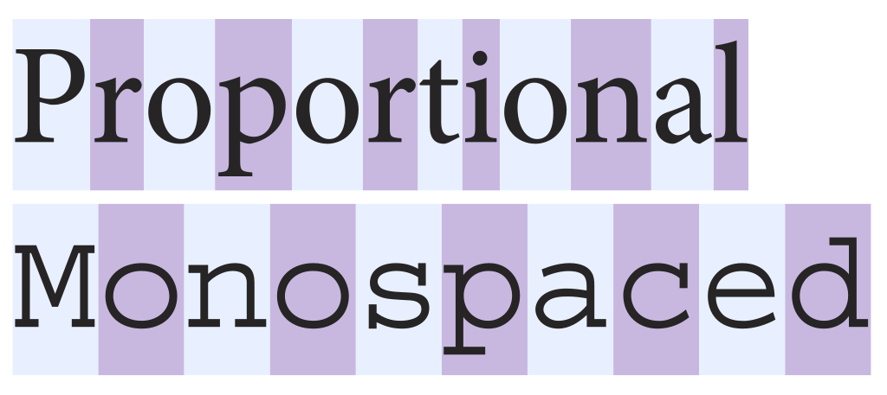

# コーディング向けのフォント

## フォントとは

> ① 大文字・小文字・数字など、同一書体で、同一の大きさの欧文活字のひとそろい。  
> ② コンピューターが表示、または印刷に使う文字の形を収めたデータ。  
> ③ ② により表示された文字。

フォントの世界は奥が深すぎるので今回はテーマに沿った内容のみ触れる。



## 等幅フォント(monospaced font)

文字通り、字体の幅を固定幅（モノスペース）で実装したフォント。

- 文字の種類により文字幅が変化しないため、文字数が同一であればその行は同じ幅になる。
- 同一の文字数の位置は横方向で同じ位置になる。
  - 行頭以外で縦読みを仕込むためにはこれが重要だったり
- コンピュータでは、初期の頃は画面に表示される文字も印刷される文字も等幅フォントのみだった。
- コマンドプロンプトやターミナルなどのCUI環境では今でも等幅フォントが使われている。
- JIS文字集合における等幅フォントとは、日本語やアイヌ語を表記するのに使われる文字群（平仮名、片仮名、漢字、句読点、括弧など）の字体を全角等幅などの固定幅、その他のラテン文字を半角等幅などの固定幅で実装したものを指す。
- 「P」を付けたフォントをプロポーショナルフォント、付けていないフォントを等幅フォントとして区別しているケースがよくある。

等幅フォントの例
|フォント名|文字集合|備考|
|----|----|----|
|Monospace|ラテン文字|Linuxに搭載|
|Courier|ラテン文字|macOS, Windowsに搭載|
|MSゴシック<br>MS明朝|JIS X 0213|Windowsに搭載|
|HGフォント各種|JIS X 0208|MS Officeに付属|

みんな大好き（？）HG創英角ポップ体もこちらに属する。

## プロポーショナルフォント(proportional font)

文字ごとに文字幅が異なるフォントのこと。  
日本語では可変幅フォントともいう。  
例えば「I」と「W」では明らかに文字の幅が異なるが、等幅フォントだと余分な空白を入れて文字幅を揃える必要がある。  
余分な空白を付けないでただ並べるだけなのがプロポーショナルフォントであり、読みやすい単語が印字できるようになる。  
GUIが主流になり、プロポーショナルフォントを扱うのに技術的な制約がなくなってきた頃からはこちらに属するフォントも数多く登場するようになった。

|フォント名|文字集合|備考|
|----|----|----|
|Century|ラテン文字<br>キリル文字<br>ほか|Linux, MS Officeに搭載|
|Arial|ラテン文字<br>キリル文字<br>ほか|macOS, Windowsに搭載|
|MS Pゴシック<br>MS P明朝<br>メイリオ|JIS X 0213|Windowsに搭載|
|游ゴシック|Adobe-Japan1-6|Windowsに搭載|
|HGPフォント各種|JIS X 0208|MS Officeに付属|

## コーディング向けのフォント
読みやすいソースコードにするテクニックの1つに「整列」がある。  
関数の引数や配列の要素等を並べる際に適宜空白を入れることで読みやすくする方法である。

```cpp
matf sample_mat[3] ={
  {"Alice",   "アリス",     100,  90,   80,   90, true },
  {"Bob",     "ボブ",       90,   80,   70,   80, false},
  {"Charlie", "チャーリー", 70,   100,  70,   80, false}
}

int calc2D{ uint16_t width,  uint16_t height};                   // 2次元データの計算
int calc3D{ uint16_t width,  uint16_t height,  uint16_t depth};  // 3次元データの計算
int max2D{  uint8_t  maxw,   uint8_t maxh};                      // 2次元データの最大値の計算
int max3D{  uint8_t  maxw,   uint8_t maxh,     uint8_t  maxd};   // 3次元データの最大値の計算
int min2D{  uint8_t  minw,   uint8_t minh};                      // 2次元データの最小値の計算
int min3D{  uint8_t  minw,   uint8_t minh,     uint8_t  mind};   // 3次元データの最小値の計算
int ave2D{  uint8_t  avew,   uint8_t aveh};                      // 2次元データの平均値の計算
int ave3D{  uint8_t  avew,   uint8_t aveh,     uint8_t  aved};   // 3次元データの平均値の計算
```

等幅フォントであれば綺麗に行が揃うが、プロポーショナルフォントだとガタガタで台無しになる。  
このように上下行の位置関係が重要になるコーディングでは等幅フォントであることは必須といえる。

### ソースコードに日本語が含まれる場合

さらに日本語のような全角文字も使う場合は、全角：半角の比率が2:1になっていることも重要である。

デフォルトでは等幅フォントが指定されている

## 条件に合うフォントを探してみる

- 日本語対応
- 等幅フォント
- 全角：半角が2:1

フォントは世の中に数多くあるが、上記の条件を全て満たすものは意外と多くない。
Windows7にプリインストールされているものに限るとMSゴシックとMS明朝しかない（調べた限りでは）。

そして視認性の観点で次の文字が容易に区別できるかが重要である。
・1（イチ）とI（アイ）とl（エル）と|（バーティカルバー）
・i（アイ）とj（ジェイ）
・0（ゼロ）とO（オー）

今回は調査対象にしていないが、収録漢字数も重要なポイントである。

|フォント名|ベースフォント|イチ系|アイ系|ゼロ系|備考|
|----|----|----|----|----|----|
|MS ゴシック|（オリジナル）||||Windowsにプリインストール|
|MS 明朝|（オリジナル）||||Windowsにプリインストール|
|UDデジタル教科書体N-R|||||Windows10にプリインストール|
|UDデジタル教科書体N-B|||||Windows10にプリインストール|
|BIZ UDゴシック|||||Windows10にプリインストール|
|BIZ UD明朝|||||Windows10にプリインストール|
|M+|（オリジナル）|||||
|IPAゴシック|（オリジナル）|||||
|Noto Sans<br>Source Han Sans(源ノ角ゴシック)|（オリジナル）|||||
|ゆたぽん|（オリジナル）|||||
|Migu1M|M+とIPAゴシック|||||
|VLゴシック|M+とさざなみゴシック|||||
|Rounded M+|M+|||||
|Mgen+|M+と源ノ角ゴシック|||||
|Rounded Mgen+|M+と源ノ角ゴシック|||||
|源真ゴシック|源ノ角ゴシック|||||
|源柔ゴシック|源ノ角ゴシック|||||
|Nasu|源真ゴシック|||||
|Ricty|Inconsolata（英）<br>Migu1MとIPAゴシック（日）||||自前で生成する必要あり|
|RictyDiminished|Inconsolata（英）<br>CircleM+1m（日）|||||
|Myrica|Inconsolata（英）<br>源真ゴシック（日）|||||
|MyricaM|Inconsolata（英）<br>Mgen+（日）|||||
|Cica|HackとDejaVu Sans Mono（英）<br>Rounded Mgen+（日）|||||
|meiryoKe|メイリオ（Win版）||||自前で生成する必要あり|
|Osaka|Osaka（Mac版）||||ライセンス的にグレー？|

その他人気があるフォント

|フォント名|ベースフォント|イチ系|アイ系|ゼロ系|備考|
|----|----|----|----|----|----|
|Source Han Code JP|Source Code Pro（英）<br>源ノ角ゴシック（日）||||全角：半角が3:2|
|FiraCode||||日本語非対応、合字対応|

### 参考リンク

[書くためのフォント ～ 美しい等幅フォント (1)](http://www.classicajapan.com/wn/2012/03/200050.html)

[日本語等幅フォント](https://qiita.com/hamaguchitm/items/546d40b7777bd9242e78)

[Windowsに標準で入っている和文フォントを見る＆試す](https://www.rakda3.net/windows_fonts/)

[等幅フォント比較：プログラミング用](https://qiita.com/vmmhypervisor/items/2d6b39d21ed68bd746c0)

[【2019年版】プログラミングが捗るコーディングに適したフォント集](http://note.kurodigi.com/2019-programing-font/)
