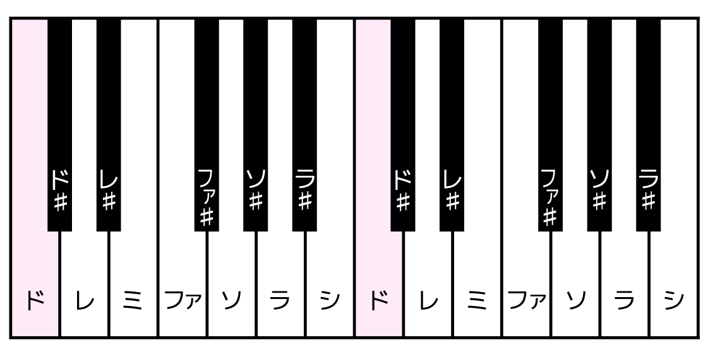
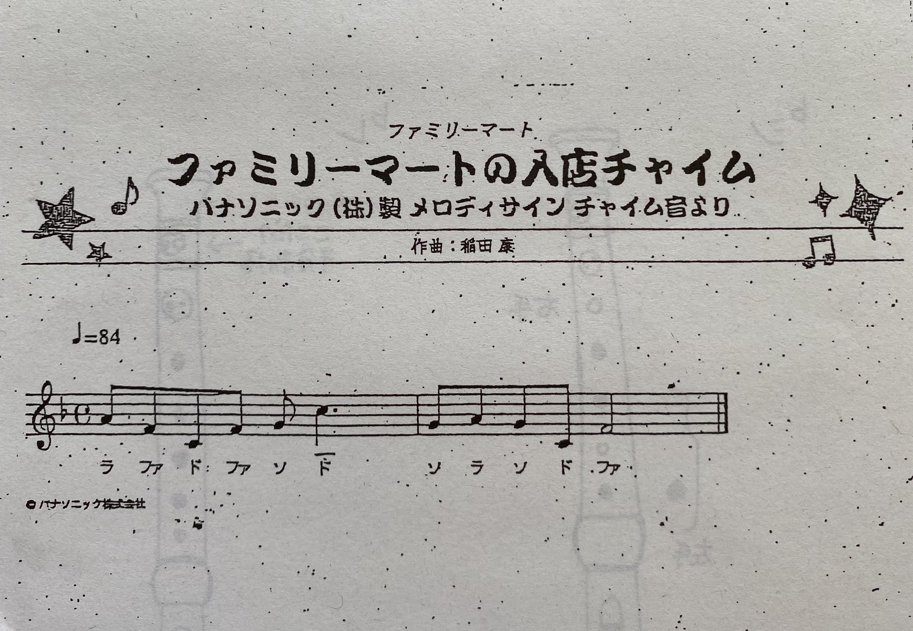

# プログラミングでなんちゃってDTM

## 使用するPythonライブラリ

### PyAudio

名前からわかる通りPythonで音声を扱うためのライブラリ。

音声の録音、再生、書き出し等ができる。

### Numpy

いつもの

## まずはラの音を作る

コンピュータにおける音声データは（雑に言えば）ただの1次元の時系列データである。

さらに、楽器や人の声によって奏でられる「楽音」の1音1音は正弦波の集合であるので、  
一般的な数式を使うだけで簡単に作ることができる。

例えばラの音の基本周波数は440Hz（[ISO標準](https://www.iso.org/standard/3601.html)）なので、  
ラの純音なら振幅が[-1,1]の区間、周波数が440Hzの正弦波の配列データを作ればよい。

```python
import pyaudio
import numpy as np

# サンプリングレートを定義
RATE = 44100

# BPMや音長を定義
BPM = 120
L1 = (60 / BPM * 4)
L2,L4,L8 = (L1/2,L1/4,L1/8)

# サイン波を生成
def tone(freq, length, gain):
    slen = int(length * RATE)
    t = float(freq) * np.pi * 2 / RATE
    return np.sin(np.arange(slen) * t) * gain

# 再生
def play_wave(stream, samples):
    stream.write(samples.astype(np.float32).tostring())

# 音声を出力するためのストリームを開く
p = pyaudio.PyAudio()
stream = p.open(format=pyaudio.paFloat32,
                channels=1,
                rate=RATE,
                frames_per_buffer=1024,
                output=True)

# サイン波を再生する
print("play")
play_wave(stream, tone(440, L1, 1.0)) 
stream.close()
```

### channels

1ならモノラル音声、2ならステレオ音声になる。3以上ならサラウンドになりそうだけど対応しているかは知らない。

当然channelsの値を増やせばその分の音声データが必要になる。

### rate

サンプリングレートのこと。とりあえずCD音質であり、PC上でもよく使われる44100Hzに設定する。

### frames_per_buffer

バッファに蓄えておくフレーム数？大きいほどメモリを食うけど安定しそう。

### output

Trueならこのストリームを出力用として使用できる。

## 他の音階を作る



中央のラの音(440Hz)の1オクターブ上のラの音は880Hzであり、逆に1オクターブ下のラの音は220Hzである。

1オクターブ上がると周波数は2倍になるということがわかる。

### 問題その1

次のプログラムではどのようなフレーズになるでしょうか？

```python
play_wave(stream, tone(440, L8, 1.0)) 
time.sleep(0.75) 
play_wave(stream, tone(440, L8, 1.0)) 
time.sleep(0.75) 
play_wave(stream, tone(440, L8, 1.0)) 
time.sleep(0.75) 
play_wave(stream, tone(880, L1, 1.0)) 
```


1オクターブの間には12個の音程（鍵盤でいうと白鍵と黒鍵の合計）がある。

隣り合った2つ（例えばドとド♯）の音程の差は「半音」と表現される。

つまり12個分の半音が上がると1オクターブ上がるが、これらの音の基本周波数はどのように定義されるのか？

### 十二平均律

単純に1オクターブの間を12等分して1つ1つの音程を当てはめた音律。

つまり、半音上がると周波数は$\sqrt[12]{2}$倍になる。

現代ではこの音律を使って楽器を調律するのが一般的になっている。

他の音律については「ピタゴラス音律」「純正律」とかでググってみてください。

###  各音の定義を追加

```python
# 音階の周波数を定義
A = 440
C4,Cs4,D4,Ds4,E4,F4,Fs4,G4,Gs4,A4,As4,B4,C5 = (
	A*(2**(-9/12)), A*(2**(-8/12)), A*(2**(-7/12)), 
    A*(2**(-6/12)), A*(2**(-5/12)), A*(2**(-4/12)), 
    A*(2**(-3/12)), A*(2**(-2/12)), A*(2**(-1/12)),
	A, A*(2**(1/12)), A*(2**(2/12)), A*(2**(3/12))
	)

# サイン波を再生する
print("play")
play_wave(stream, tone(C4, L4, 1.0)) 
play_wave(stream, tone(D4, L4, 1.0)) 
play_wave(stream, tone(E4, L4, 1.0)) 
play_wave(stream, tone(F4, L4, 1.0)) 
play_wave(stream, tone(G4, L4, 1.0)) 
play_wave(stream, tone(A4, L4, 1.0)) 
play_wave(stream, tone(B4, L4, 1.0)) 
play_wave(stream, tone(C5, L4, 1.0)) 
stream.close()
```

### 問題その2

次のプログラムではどのようなフレーズになるでしょうか？

```python
play_wave(stream, tone(A4, L8, 1.0)) 
play_wave(stream, tone(F4, L8, 1.0)) 
play_wave(stream, tone(C4, L8, 1.0)) 
play_wave(stream, tone(F4, L8, 1.0)) 
play_wave(stream, tone(G4, L8, 1.0)) 
play_wave(stream, tone(C5, L4, 1.0)) 
time.sleep(0.25) 
play_wave(stream, tone(G4, L8, 1.0)) 
play_wave(stream, tone(A4, L8, 1.0)) 
play_wave(stream, tone(G4, L8, 1.0)) 
play_wave(stream, tone(C4, L8, 1.0)) 
play_wave(stream, tone(F4, L4, 1.0)) 
```

### 答え


### 参考リンク

[Pythonで音楽 - PyAudioとNumPyで楽器を作ろう](https://news.mynavi.jp/article/zeropython-55/)
