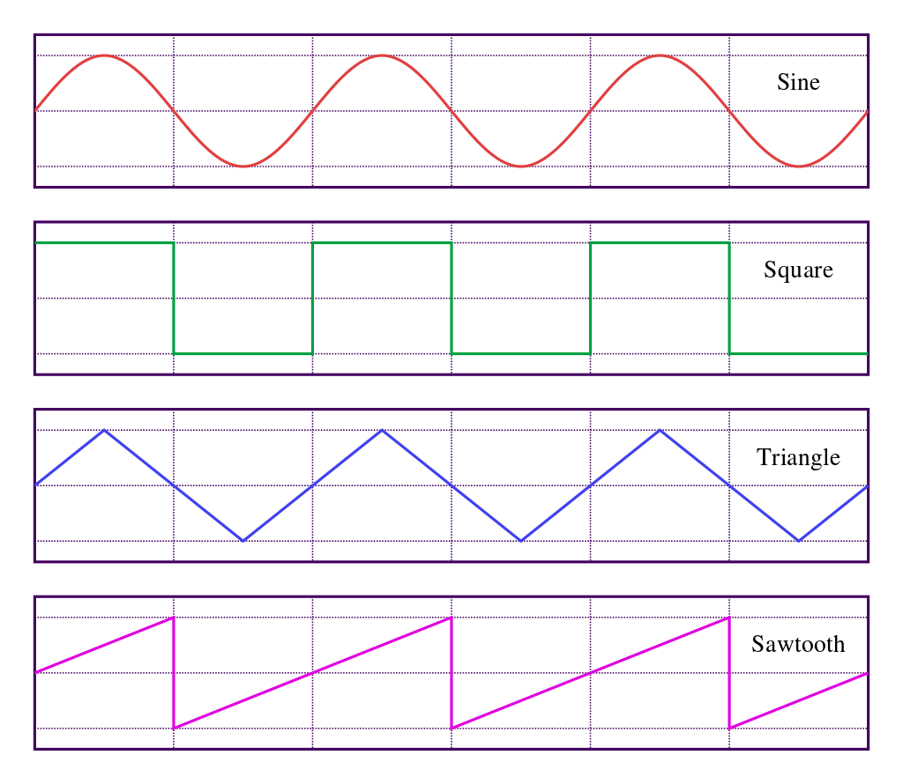

# プログラミングで音を作る（その2）

## 違う音色の音を作る

正弦波以外で数式表記が容易な音色を作る。

### のこぎり波（鋸歯状波）

波形の見た目がのこぎりの歯のように見えることからこう呼ばれる。

のこぎり波の波形は時間とともに上昇し、ピークに達したところで急降下するということの繰り返しとなっている。

逆に徐々に降下していってから急上昇する「逆のこぎり波」もある。

数式は次のように表される。

$$x(t) = t - \mathrm{floor}(t)$$

また、のこぎり波は正弦波を合成することで近似することができる。

$$x_{sawtooth}(t)=\frac{2}{\pi}\sum_{k=1}^{\infty}\frac{sin(kt)}{k}$$

この近似を使って実装……したかったのですがうまくいかないので、  
代わりにscipyの便利な関数を使用する。

#### scipy.signal.sawtooth(t, width=1)

https://docs.scipy.org/doc/scipy/reference/generated/scipy.signal.sawtooth.html

### 三角波

こちらは波形の見た目が三角形になっていることからこう呼ばれる。

三角波は基本周波数の奇数倍音の正弦波を合成することで近似することができる。

$$x_{triangle}(t)=\frac{8}{\pi^2}\sum_{k=1}^{\infty}sin(\frac{k\pi}{2})\frac{sin(kt)}{k^2}$$

三角波はのこぎり波でも使用した

scipy.signal.sawtooth(t, width=1)

の関数の2つ目の引数に0.5を指定することで簡単に作れる。

### 矩形波（方形波）

こちらは波形の見た目が矩形（長方形）になっていることからこう呼ばれる。~~なんで四角波と呼ばないのか~~

矩形波も基本周波数の奇数倍音の正弦波を合成することで近似することができる。

$$x_{triangle}(t)=\frac{4}{\pi^2}\sum_{k=1}^{\infty}\frac{sin((2k-1)2{\pi}ft)}{2k-1}$$

矩形波もscipyの関数で簡単に作ることができる。

### scipy.signal.square(t, duty=0.5)

https://docs.scipy.org/doc/scipy/reference/generated/scipy.signal.square.html

矩形波はduty比を変えることで微妙に異なる音色になるが、  
この関数でも2つ目の引数の値によってdutym比を変えることが可能である。

### 参考リンク

