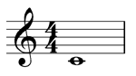

# プログラミングで音楽を扱う（その3）

## 演奏データの外部入力に対応させる

前回までは数小節の単音のフレーズを扱っていたためソースに直接演奏データを記述していたが、  
まともな曲を演奏させようとすると数十小節の複合音の演奏データが必要になる。  
これをそのままソースに記述するのはあまり美しくない。

また、直接ソースに記述する方法だと1曲ごとに別の演奏プログラムを用意する必要が出てきてしまう。  
これもあまりスマートな方法ではない。

そこで、外部の演奏データファイルを演奏プログラムに入力することを考える。

### 案1：独自記法で記述したファイルに対応させる

テキストファイルでも何でもよいので、ぼくのかんがえたさいきょうのふぉーまっとで書いたデータを読み込む。

〇演奏プログラム側の都合に合わせて記法を捻じ曲げられるので、データの扱いが非常に楽  
×汎用性が皆無

### 案2：MIDIファイルに対応させる

電子楽器の演奏データを機器間で転送・共有するための共通規格であるMIDI(Musical Instrument Digital Interface)形式のファイルを読み込めるようにする。

〇手持ちのMIDIファイルをそのまま利用できる  
×MIDIファイルはバイナリデータなので解析に骨が折れる

### 案3：MusicXMLファイルに対応させる

XML形式で楽譜を表記する規格であるMusicXMLファイルを読み込めるようにする。

〇手持ちのMIDIファイルを容易にMusicXML形式に変換して読み込める  
△XMLの解析に骨が折れるがMIDIよりはマシ（？）


というわけで今回は案3を採用します。

## MusicXMLとは

https://www.musicxml.com/
より引用

> インターネット上でインタラクティブな楽譜データをやりとりするには？  
> 異なる楽譜作成ソフトのユーザーと共同作業するには？
>
> MusicXMLがこれらを可能にします。
>
> MusicXMLは、アプリケーション間でデータを共有したり、将来への資産としてデータをアーカイブするためにデザインされました。MusicXMLファイルは、Finaleを始めとして現在（そして将来）の数多くのアプリケーションで開くことができ、それらのアプリケーションの純正のファイル形式に変換して使用>することが可能になります。
>
> MP3ファイルが音楽データ共有の代名詞となったように、MusicXMLは楽譜データ共有のスタンダードとなりました。MusicXMLにより、特定のアプリケーシ>ョンで作成されたデータは、他の製品を使用しているユーザーと相互にやり取りできるようになります。現在では240以上のアプリケーションがMusicXMLをサポートしています。

## MusicXMLのFAQ

### なぜ新しい楽譜フォーマットが必要だったのか

世の中には多くの素晴らしい音楽用コンピュータプログラムがある。  
しかし残念ながらそれらの間で音楽データを共有することは困難だった。  
使用したいプログラムごとに音楽データを再入力する必要があるのは非常に不便だった。

MusicXML以前、一般的にサポートされている唯一の楽譜の互換形式はMIDIだった。  
MIDIはシーケンサーのような演奏アプリケーションにとっては素晴らしいフォーマットだが、楽譜用としては適していない。  
F♯とG♭の違いを区別したり、リピートやスラーのような表記法が困難となっている。

インターネット音楽の成長には、インターネット対応の標準フォーマットが必要だった。  
MusicXMLの登場以前は、HTMLが発明される前にインターネットを使用したり、MIDIが発明される前にシンセサイザーを使用するようなものだった。

### なぜXMLを使用するのか？

XMLは、音楽ソフトウェアが今日直面しているようなタイプの問題を正しく解決できるように設計されている。  
それぞれが独自フォーマットを持っている100個の音楽アプリケーションがあるとする。  
それぞれのアプリケーションがお互いに通信しようとすると、共通の言語インターフェース無しだと10000個ものプログラムを書く必要がある。  
共通のインターフェース言語を使えば、100個のアプリケーションが必要とするのは1つのプログラムだけで済む。  
コンシューマーはソフトウェア開発者に対して比較的少ないコストをかけるだけで大きな価値を得ることができる。

XMLは、その前身のSGMLからの数十年でHTMLとWebの爆発的な成長と同様の経験をしている。  
XMLは複雑で構造化されたデータをシンプルに表せるように設計されているが、楽譜はそれにマッチする。

## MusicXMLの「Hello World」

MusicXMLでは、「Hello World」という歌詞の曲は必要以上に複雑である。  
もっとシンプルに、4/4拍子での中央Cの全音符とする。



```xml
<?xml version="1.0" encoding="UTF-8" standalone="no"?>
<!DOCTYPE score-partwise PUBLIC
    "-//Recordare//DTD MusicXML 3.1 Partwise//EN"
    "http://www.musicxml.org/dtds/partwise.dtd">
<score-partwise version="3.1">
  <part-list>
    <score-part id="P1">
      <part-name>Music</part-name>
    </score-part>
  </part-list>
  <part id="P1">
    <measure number="1">
      <attributes>
        <divisions>1</divisions>
        <key>
          <fifths>0</fifths>
        </key>
        <time>
          <beats>4</beats>
          <beat-type>4</beat-type>
        </time>
        <clef>
          <sign>G</sign>
          <line>2</line>
        </clef>
      </attributes>
      <note>
        <pitch>
          <step>C</step>
          <octave>4</octave>
        </pitch>
        <duration>4</duration>
        <type>whole</type>
      </note>
    </measure>
  </part>
</score-partwise>
```

```xml
<?xml version="1.0" encoding="UTF-8" standalone="no"?>
```

これは全てのXMLドキュメントに必要なXML宣言である。  
standaloneの値を"no"に設定すると別のファイルに外部定義を持つドキュメントとなる。

```xml
<!DOCTYPE score-partwise PUBLIC

    "-//Recordare//DTD MusicXML 3.1 Partwise//EN"
    "http://www.musicxml.org/dtds/partwise.dtd">
```

ここでMusicXMLを使用していることを宣言する。  
インターネット上のDTDの所在を含むパブリック宣言を使用する。  
このURLは参照用である。
MusicXMLファイルを読み込むほとんどのアプリケーションではMusicXML DTDのローカルコピーをユーザーマシンにインストールする必要がある。  
XMLパーサー内のリゾルバはネットワーク上の読み込みが遅いDTDではなくローカルコピーに対して検証を行う。

```xml
<score-partwise version="3.1">
```

これはルートドキュメントタイプを表す。  
`<score-partwise>`はドキュメントがパートごとに構成され、各パートは小節ごとに構成されている。  
`<score-timewise>`オプションもあり、こちらはドキュメントが小節ごとに構成され、各小節はパートごとに構成されている。  
プログラムはバージョン属性により使用しているMusicXMLのバージョンをより簡単に区別できる。  
MusicXML 1.0の場合は省略可能。

```xml
  <part-list>
    <score-part id="P1">
      <part-name>Part 1</part-name>
    </score-part>
  </part-list>
```

楽譜がpartwiseでもtimewiseでも、MusicXMLは楽譜のさまざまな音楽パートがリストになっているヘッダで始まる。  
上記の例は、1つのパート、パートに必要なid属性、必要なパート名が含まれた最小限のパートリストとなっている。

```xml
  <part id="P1">
```

これでドキュメント内の最初の（そしてこの例では唯一の）パートが始まる。  
ここのid属性はヘッダのid属性を参照する必要がある。

```xml
    <measure number="1">
```

最初のパートの最初の小節が始まる。

```xml
      <attributes>
```

attributes要素には音符と音楽データを解釈するために必要な重要な情報が次に続いて含まれる。  


```xml
        <divisions>1</divisions>
```

MusicXMLの各音符にはduration要素がある。  
division要素は四分音符ごとの分割に関するduration要素に対して小節単位を与える。  
このファイルにあるのはたった1つの音符であるため、四分音符に分割する必要はない。  
よって分割値は1に設定する。

音楽の継続時間は通常、「四分音符」や「八分音符」などの分数で表される。  
MusicXMLの継続時間も分数で表される。  
分母を変更する必要はほとんどなく、division要素で個別に表されるため個々の音符では分子のみを関連付ける必要がある。

```xml
        <key>
          <fifths>0</fifths>
        </key>
```

key要素は調号を表すために使用される。  
ここではCメジャーのキーにあるため、フラットやシャープはない。  
したがってfifth要素は0となる。  
2つのシャープを持つDメジャーにいた場合、fifth要素は2に設定される。  
もし1つのフラットを持つFメジャーにいた場合、fifth要素は-1に設定される。


"fifth"という名前は五度圏に沿って調号を表現しているところから来ている。


これによりシャープとフラットという個別の要素の代わりに、1つの要素で標準的な調号を表すことができる。

```xml
        <time>
          <beats>4</beats>
          <beat-type>4</beat-type>
        </time>
```

time要素は拍子を表す。  
この2つの構成要素、beatとbeat-typeは拍子の分子と分母である。

```xml
        <clef>
          <sign>G</sign>
          <line>2</line>
        </clef>
```

MusicXMLでは、現在使用されていない多くの音部記号を使用できる。  
ここでは、標準の高音部記号はト音記号で表される。

```xml
      </attributes>
      <note>
```

これでattributesが完成し、最初の音符を始める準備が整った。

```xml
        <pitch>
          <step>C</step>
          <octave>4</octave>
        </pitch>
```

pitch要素にはstepとoctave要素が必要である。  
フラットまたはシャープが含まれる場合、オプションでalter要素を持てる。  
これらの要素は音を表すため、alter要素の変更が調号にある場合でも、使用する場合は常に含める必要がある。  
今回のケースでは必要ない。

ピッチステップはCである。  
4オクターブは中央から始まるオクターブを示す。  
したがって、この音符は中央Cである。

```xml
        <duration>4</duration>
```

divisionの値は四分音符ごとに1divisionなので、4durationは4分音符4つ分、つまり全音符となる。

```xml
        <type>whole</type>
```

type要素は音符に対して全体の区間を演奏することを表している？
ジャズでスイング感を出したい場合に同じ8分音符でも異なる音の継続時間の値を使用できる。  
duration要素は特定の演奏に合わせて長さを長くまたは短くするのではなく、意図する長さを反映する必要がある。  
音符の開始時間と終了時間を楽譜に示された継続時間から直接または間接的に変更する手段として、note要素にはアタック（鳴り始め）とリリース（鳴り終わり）の属性がある。  

```xml
      </note>
```

これで音符が終了する。

```xml
    </measure>
```

これで小節が終了する。

```xml
  </part>
```
　
これでパートが終了する。

```xml
</score-partwise>
```

そしてこれで楽譜が終了する。

### 補足

XMLのドキュメントタイプ定義の制限の1つとしては、別の要素内の要素数を制限したい場合、一般的にそれらの順序も制限する必要がある。  
例えば、1つの属性には、1つのdivision要素のみが必要である。  
音符のpitchには、ただ1つのstep要素とoctave要素が必要である。  
このために、これらの要素が現れる順序は制限されている必要がある。

したがって、これらの例で要素が現れる順序は重要である。  
ここでは省略するが、DTD定義では必要な順序付けを明確にしている。

### 参考リンク

[MusicXML 3.1 チュートリアル](https://www.musicxml.com/tutorial/)