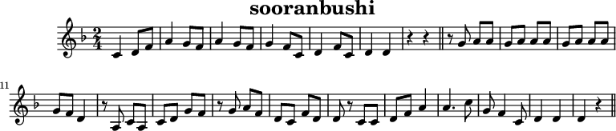

# プログラミングで音楽を扱う（その4）

## どの楽譜データ形式を採用するか検討

### MusicXMLで表示してみる

MuseScoreというフリー楽譜作成ソフトを使用する。  
（ちなみに商用ならFinaleやSibeliusというソフトも存在する）

※このソフトではPNG等の画像形式、PDF形式による楽譜出力や、  
WAV形式、MP3形式等による音楽ファイルとしての出力にも対応している。

予め作成したMIDIファイルを読み込み、MusicXMLファイルとしてエクスポートする。

圧縮形式(.mxl)と非圧縮形式(.musicxml)で出力可能だが、  
テキストとしてまともに読めるのは非圧縮形式の方なのでこちらを選択する。

### MIDIファイルをそのままバイナリ形式で表示してみる

Stirlingを使用して表示する。

### MML(Music Macro Language)形式で表示してみる

MIDIからMMLへの変換ツールは数多く存在する。

ツールは大まかに

- 元のMIDIデータの忠実な再現を重視して変換する
- MMLの特徴であるシンプルさを重視して変換する

という異なる2つの観点で変換を行っているため、結果がばらつきやすい。

各ツールでの変換結果が下記ページにまとめられている。

[各種MIDI2MMLプログラムを比較してみた](http://gocha.hatenablog.com/entry/2013/09/02/Midi2MML_Comparison)

今回は[サクラ](https://sakuramml.com/)で実際に変換してみる。

### ABC記譜法で表示してみる

#### ABC記譜法とは

ABC記譜法(ABC notation)はMMLと同様にアスキー文字を並べて譜面を表現できるように考案された記法である。

日本ではマイナーだが、欧米のネットユーザー間ではかなり普及している（らしい）。



```
X:1
T:sooranbushi
M:2/4
L:1/8
K:F
C2 DF | A2 GF | A2 GF | G2 FC | D2 FC | D2 D2 | z2 z2 ||
zG AA | GA AA | GA AA | GF D2 | zA, CA, | CD GF | zG AF | DC FD | D z CC |
DF A2| A3 c | G F2 C | D2 D2 | D2 z2||
```
- X:1　はファイルナンバーを表す。
- T:sooranbushi　はタイトルを表す。
- M:2/4　は4分の2拍子であることを表す。
- L:1/8　は1文字の長さを8分音符とすることを表す。
- K:F　は調がヘ長調（Fメジャー）であることを示す。
- 「CDEFGAB」はそれぞれ「ドレミファソラシ(ドの絶対音高をCとした場合)」を表す。
- 「z」は休符を表す。
- 1オクターブ高い音は小文字で、さらにそれより高い音は右上に「'」を付けて表す。
- 1オクターブ低い音は文字の直後に「,」を打って表す。
- 各英字の後ろの数字（整数・分数いずれも可）は、音符の長さを示す。例:「L:1/8」のとき、「D2」＝「D」の2倍の長さ（レの4分音符）、「D1/2」＝「D」の半分の長さ（レの16分音符）
- 「|」は小節の区切り。スペースは意味を成さないが、通常見やすいように一拍を数える箇所に挿入する。

#### MIDIからABCへ変換する

MIDIからABCへの変換ツールもまた数多く存在するが、  
今回は[EasyABC](https://www.nilsliberg.se/ksp/easyabc/)を使用する。

#### ちなみに

https://www.lotro.com/forums/showthread.php?522150-Maestro-MIDI-to-ABC-converter-for-LOTRO
https://github.com/ntabee/MoEToiro
http://www.starboundcomposer.com/


## MusicTeX, MusiXTeX

TeXによる楽譜の粗飯を可能とするオープンソースのマクロおよびフォント集。

MIDIとの変換に関する情報が不足しているため省略。


### まとめ

一番忠実に変換できる：MusicXML

一番解析が簡単そう：MML

一番変換結果がシンプル：ABC