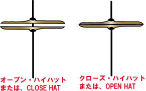

# プログラミングで音楽を扱う（その6）

## ノイズチャンネルを作る

ファミコン（FC）音源やゲームボーイ（GB）音源はそれぞれ以下のチャンネルで構成される。

【FC（内蔵）音源】
- 矩形波	：2ch
  - duty比は12.5%, 25%, 50%, 75%が使用可
- 三角波	：1ch
  - 16段階のギザギザ波形
- ノイズ	：1ch
  - 長周期（ザーという音）、短周期（ギーという音）が使用可能
- DPCM		：1ch

【GB音源】
- 矩形波	：2ch
  - duty比は12.5%, 25%, 50%, 75%が使用可
- 波形メモリ：1ch
- ノイズ	：1ch
  - 長周期（ザーという音）、短周期（ギーという音）が使用可能

このうち矩形波や三角波は前回までに作成している。

それ以外では、ノイズはこれらの音源における打楽器パートや効果音として
使用されることが多く、重要な意味を持つ。

ということで今回はノイズを作成する。

### 一般的なノイズの作り方

一般的に使われるホワイトノイズは全ての周波数において強さが一定となるノイズであり、  
これは正規乱数を生成して使うのが一般的である。

pythonでは下記の通り簡単に作成できる。

```python
	# 引数は平均、分散、件数
    return np.random.normal(0.0, 1.0, len)
```

### FCやGBのノイズの作り方

FC音源やGB音源では線形帰還シフトレジスタ(LFSR:Linear Feedback Shift Register)  
を使用して生成した疑似乱数がノイズとして使用される。


ランダム生成モードフラグがセットされていればショート（短周期）モード、  
クリアされていればロング（長周期）モードとなる。

ショートモードの時は1周期93ビット、 ロングモードの時は1周期32767ビットである。

15ビットシフトレジスタにはリセット時に1をセットしておく必要がある。  
タイマによってシフトレジスタが励起されるたびに1ビット右シフトし、  
ビット14には、ショートモード時にはビット0とビット6のEORを、  
ロングモード時にはビット0とビット1のEORを入れる。

シフトレジスタのビット0が1なら、チャンネルの出力は0となる。 

これをpythonプログラムで再現すると以下のようになる（はず）。

長周期ノイズ
```python
    slen = int(length * 44100)	# サンプル数
    nline = np.empty(slen)
    reg = 0x8000	# レジスタのビット15に1をセット
 
    for idx in range(slen):
        reg = reg >> 1	# レジスタを1ビット右シフト
        reg = reg | (((reg ^ (reg >> 1)) & 1) << 15)	# レジスタのビット14にビット0とビット1のEORをセット
        nline[idx] = reg & 1	# レジスタのビット0を出力

    return nline
```

短周期ノイズ
```python
    slen = int(length * 44100)	# サンプル数
    nline = np.empty(slen)
    reg = 0x8000	# レジスタのビット15に1をセット
 
    for idx in range(slen):
        reg = reg >> 1	# レジスタを1ビット右シフト
        reg = reg | (((reg ^ (reg >> 6)) & 1) << 15)	# レジスタのビット14にビット0とビット6のEORをセット
        nline[idx] = reg & 1	# レジスタのビット0を出力

    return nline
```

最終的な出力は0か1の2値データとなる。

これはある意味でFC音源やGB音源のノイズが「周期が不規則な矩形波」で出来ていると言える。

## 打楽器パートをノイズチャンネルで再現する

### MMLにおける打楽器パートの音高と音長の解析

今回使用する打楽器はオーソドックスなドラムセットに含まれる

- スネアドラム
- バスドラム
- ハイハットシンバル（オープン）
- ハイハットシンバル（クローズ）

の4種類の音のみとする。




これをMIDIで打ち込んだものが以下の通り。


そしてこれをMMLに変換すると以下のようになる。

```mml
v100o3c192r%230f+192r%230c192r%110c192r%110f+192r%230f+192r%470a+192r%470	|
f+192r%110f+192r%230c192r%110c192r%110f+192r%350f+192r%110f+192r%110a+192r%230f+192r%110f+192r%110f+192r%110f+192r%110	|
f+192r%110f+192r%230c192r%110c192r%110f+192r%350f+192r%110f+192r%110a+192r%230f+192r%110f+192r%110f+192r%110f+192r%110	|
f+192r%110f+192r%230c192r%110c192r%110f+192r%350f+192r%110f+192r%110a+192r%230f+192r%110f+192r%110f+192r%110f+192r%110	|
f+192r%350c192r%110c192r%230e192r%1190	|
c192r%230f+192r%110f+192r%110f+192r%230c192r%110c192r%110c192r%230c192r%230e192r%230c192r%230	|
c192r%230f+192r%110f+192r%110f+192r%230c192r%110c192r%110c192r%230c192r%230e192r%230c192r%230	|	
```

（以下繰り返しのため省略）

MIDIデータとMMLデータを照合すると

c	：バスドラム
e	：スネアドラム
f+	：クローズドハイハット
a+	：オープンハイハット

と対応していることがわかる。

（Dominoのピアノロールと打楽器の並びがちょうど一致しているため、他の打楽器も同様に当てはまると考えられる）

また、音長については

音符：一律192
休符：%110, %230, %350, %470, %1190の少なくとも5パターン

で表記されている。

192というのは64分音符の3連符で使用される、MIDI上の音符の最小単位である。

つまり打楽器の音長はMMLでは正確に再現されないため、
楽器の種類と休符の長さから逆算する必要がある。

### 参考

[NES on FPGA](http://pgate1.at-ninja.jp/NES_on_FPGA/nes_apu.htm)

[FC音源とは - ニコニコ大百科](https://dic.nicovideo.jp/a/fc%E9%9F%B3%E6%BA%90)