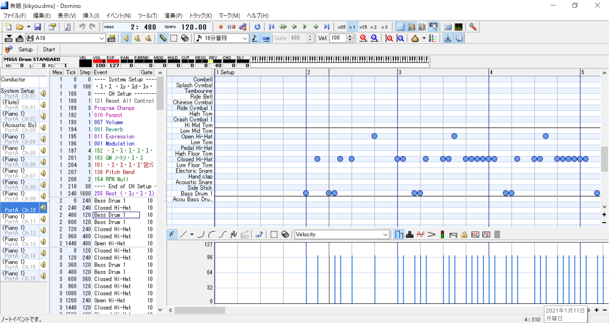

# プログラミングで音楽を扱う（その7）

## ノイズチャンネルを作る（MML解析編）


## 打楽器パートをノイズチャンネルで再現する

前回MIDIで打ち込んだ打楽器パートをMMLに変換したが、  

```mml
v100o3c192r%230f+192r%230c192r%110c192r%110f+192r%230f+192r%470a+192r%470	|
f+192r%110f+192r%230c192r%110c192r%110f+192r%350f+192r%110f+192r%110a+192r%230f+192r%110f+192r%110f+192r%110f+192r%110	|
f+192r%110f+192r%230c192r%110c192r%110f+192r%350f+192r%110f+192r%110a+192r%230f+192r%110f+192r%110f+192r%110f+192r%110	|
f+192r%110f+192r%230c192r%110c192r%110f+192r%350f+192r%110f+192r%110a+192r%230f+192r%110f+192r%110f+192r%110f+192r%110	|
f+192r%350c192r%110c192r%230e192r%1190	|
c192r%230f+192r%110f+192r%110f+192r%230c192r%110c192r%110c192r%230c192r%230e192r%230c192r%230	|
c192r%230f+192r%110f+192r%110f+192r%230c192r%110c192r%110c192r%230c192r%230e192r%230c192r%230	|	
```

（以下繰り返しのため省略）

音符：一律192
休符：%110, %230, %350, %470, %1190の少なくとも5パターン

で表記されていることがわかる。

この%を使った表記は一般的なMMLコマンド一覧には掲載されていない。つまりMMLの方言の1つである。

今回使用した変換ツールであるSMF2MMLのサイトにはこう書かれている。

> 音長は、付点13個まで対応しております。付点が13個以上つく場合は、『%』をつけ、tick表記となります。 

### tick表記とは

DTM用語辞典より引用

> ティック（tick）は、音の長さを表わす最小単位。シーケンス・ソフト上で。音の長さは小節／拍／ティックという単位で表わされるが、いずれも相対的な時間を表わすもの。1拍が何ティックに相当するかはシーケンス・ソフトの音符分解能（タイム・ベース）や曲の拍子によって異なってくるが、現在主流のシーケンス・ソフトの多くでは480ティックが4分音符の長さに相当する。したがって4分の4拍子の場合、1拍＝480ティックとなる。

つまり、MMLで表現しきれない音長についてはMIDIデータのtick表記の音長がそのまま使われていて、  
その値はMIDIデータを作成したソフトの音符分解能に依存している（はず）。

MIDIの作成に使用しているDominoの画面は次の通り。



小節の1拍進んだところが480tickになっているので、Dominoではデフォルトが1拍=480tick、  
1小節=1920tick（4/4拍子の場合）であることがわかる。

### tick表記を実時間に変換

MMLデータから音声データを出力する際、1拍あたりの実時間は60/BPMで計算できる。

1拍あたりのtick数は先に述べた通り480tickなので、  
ここからtick表記との変換レートを計算すると480tickが60/BPM秒、つまり
$$ 1tick = 1/(8*BPM)秒 $$
とわかる。これに従って処理を実装する。

……と思ったが実装中に下記のほうが簡単だとわかったため方針変更。

### tick表記を1小節あたりの長さに変換

自作シーケンサーでは音長を1小節あたりの長さで定義しているため、  
（例：全音符なら1、8分音符なら1/8）  
こっちの定義に変換する方式する。

1小節は1920tickなので、MML内のtick数を1920で割るだけで求めたい数値が得られる。

雑な実装例

```python
            if mline[i] == '%':	# 次の文字からtick表記
                if mline[i+1:i+4] =='110':
                    nlen =  110 / 1920	# 音長

                if mline[i+1:i+4] =='230':
                    nlen =  230 / 1920	# 音長
```

### 打楽器のみで演奏テスト

音色の再現性が微妙

### 通常の楽器と合成して演奏テスト

1小節分ずれているのはタイで繋がれた休符がうまく処理できていないせい？

それ以外は意外にもぴったり揃っている

### 参考

[SMF2MML](http://shaw.la.coocan.jp/smf2mml/)

[ティック（tick） - DTM用語](https://dtm.conceptmol.com/%E3%83%86%E3%82%A3%E3%83%83%E3%82%AF%EF%BC%88tick%EF%BC%89/)

