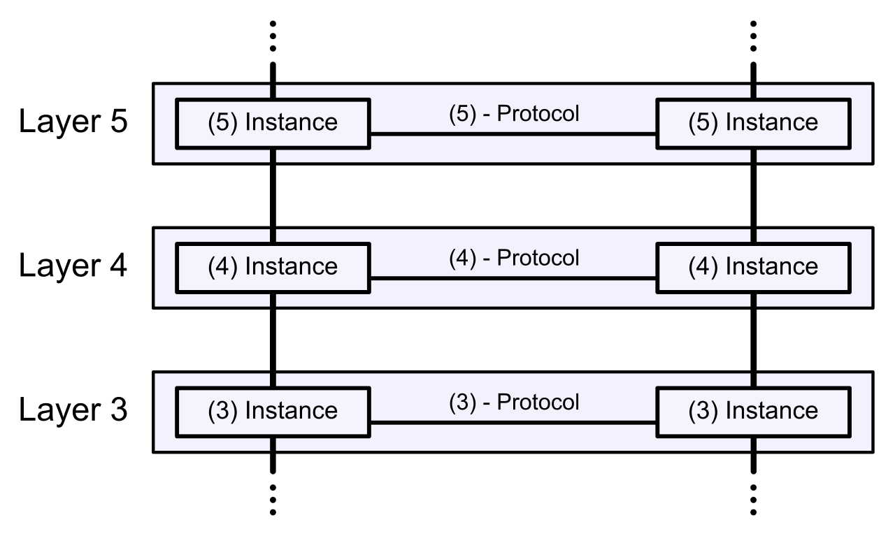

# TCP/IPの基礎

基礎的な内容だが意外と忘れがち・勘違いされがちなポイントをピックアップして紹介する。

## プロトコルの標準化

コンピュータ通信が始まった当初は、体系化や標準化が重要だとは考えられていなかった。  
各コンピュータメーカーは、それぞれ独自にネットワーク製品を作り、コンピュータ通信を実現していた。  
また、プロトコルの機能を体系づけたり、階層化することも特に強く意識されてはいなかった。

1974年、IBM社は自社のコンピュータ通信技術を体系化したネットワークアーキテクチャ、SNA(Systems Network Architecture)を発表した。  
その後、各コンピュータメーカーはそれぞれの会社独自のネットワークアーキテクチャを発表し、プロトコル群の体系化を行った。  
しかし、各社独自のネットワークアーキテクチャ、プロトコルには互換性がなく、異なるメーカーの製品を物理的に接続しても、正しく通信することはできなかった。

このような問題を解決するため、国際標準化機構のISO(International Organization for Standardization)は、国際標準としてOSI(Open Systems Interconnection)と呼ばれる通信体系を標準化した。  
現在OSIの定めるプロトコルは普及していないが、OSIプロトコルを設計する際の指針として提唱されたOSI参照モデルのはネットワークプロトコルを考えるときによく引き合いに出される。

TCP/IPはISOの国際標準ではない。TCP/IPは、IETF(Internet Engineering Task Force)で提案や標準化作業が行われているプロトコルである。大学などの研究機関やコンピュータ業界が中心となって標準化が推進され、発展してきた。

### ※標準化

標準化とは、異なるメーカーの製品同士でも互換性を持って利用できるような規格を作り上げることである。  
標準化を行う組織は大きく分けて、国際レベルの機関、国家レベルの機関、民間レベルの任意団体の3種類がある。  
国際的な組織にはISOが、国家レベルの期間には日本のJISを制定しているJISCや米国のANSIがある。IETFは任意団体に該当する。

## プロトコルの階層化

ISOはOSIプロトコルを標準化する前に、ネットワークアーキテクチャに関する議論を十分に行った。  
そして、通信プロトコルを設計するときの指標として、OSI参照モデルを提唱した。  
これは、通信に必要な機能を7つの階層にわけ、機能を分割することで、複雑になりがちなネットワークプロトコルを単純化するためのモデルである。

各階層は、下位層から特定のサービスを受け、上位層に特定のサービスを提供する。  
上位層と下位層の間でサービスのやり取りをするときの約束事を「インターフェース」と呼び、  
通信相手の同じ階層とやり取りするときの約束事を「プロトコル」と呼ぶ。

このプロトコルの階層化は、ソフトウェアを開発するときのモジュール化に似ている。  
OSI参照モデルの場合には、理想的には第1層から第7層までの7つのモジュールを作ってそれぞれをつなぎ合わせれば、通信が可能になる。  
階層化をすると各階層を独立なものとして扱うことができる利点がある。システムのある階層を変更しても、その影響がシステム全体に波及しないため、拡張性や、柔軟性に富んだシステムを構築できる。  
また、通信の機能分割が行われるため、それぞれの階層のプロトコルの実装が容易になり、それに伴い、責任分界点も明確になるという利点がある。

### 会話で階層化を考える

プロトコルの階層化について、会話を例にして簡単に説明する。  
ここでは、言語層と通信装置層の2つの階層で考えることにする。

まず、電話を使って会話する場合を考えると、電話という通信装置層を利用して日本語の言語プロトコルで話をするということになる。  
電話をする二人は日本語で直接会話しているように思えるが、実際は二人とも電話機のスピーカーから聞こえる音声を聞き、マイクに向かってしゃべっている。

人がしゃべる言語プロトコルは、音波として受話器のマイクに入り、通信装置層で電気信号の波に変換される。そして、相手の電話機まで伝わり、通信装置層で音波に変換される。  
つまり、電話をする二人は、電話機との間で音波によって言語を伝達するというインターフェースを利用しているということになる。

言語層は同じで、通信装置層を変更したらどうなるかを考えてみる。  
例えば電話を無線機に変えてみる。通信装置層で無線機を使うことになると、2つの層の間のインターフェースとして無線機の使い方を習得する必要がある。  
しかし、言語層のプロトコルとしては依然として日本語を使っているので、電話の時とまったく同じように会話ができる。

一方で、通信装置層は電話機を使って、言語層を英語に変えたらどうなるかを考えてみる。  
当然、電話機は日本語でも英語でも使えるので、日本語の時と同じように通信することができる。

当たり前のことのように思われるかもしれないが、プロトコルの階層化が便利で意味のあることが理解できる。  
このような理由から、プロトコルは階層化されている。

## OSI参照モデル

プロトコルについて簡単な2階層のモデルを使って説明したが、パケット通信のプロトコルはこれよりもかなり複雑である。  
これを整理してわかりやすくするためのモデルがOSI参照モデルである。  
OSI参照モデルは通信に必要な機能をうまくまとめている。

ここから先はこのOSI参照モデルの機能分類に、TCP/IPの機能を当てはめる形で話を進める。  
実際のTCP/IPの階層モデルはOSIとは若干異なるが、OSI参照モデルを利用することで理解を深めることができる。

なお、OSI参照モデルはあくまでも「モデル」であり、各層の大まかな役割を決めているだけで、プロトコルやインターフェースの詳細を決めるものではない。  
プロトコルの設計や勉強をするときの「ガイドライン」である。  
詳細を知りたい場合は、個々のプロトコルの仕様書を読む必要がある。

## OSI参照モデルの各層の役割

OSI参照モデルの各層の役割を簡単に説明する。

### 第7層：アプリケーション層

利用されるアプリケーションの中で通信に関係する部分を定めている。  
ファイル転送や電子メール、遠隔ログイン（仮想端末）などを実現するためのプロトコルがある。

### 第6層：プレゼンテーション層

アプリケーションが扱う情報を通信に適したデータ形式にしたり、また下位層から来たデータを上位層が処理できるデータ形式にするなど、データ形式に関する責任を持つ。

具体的には、機器固有のデータ表現形式（データフォーマット）などをネットワーク共通のデータ形式に変換する役割になる。  
同じビット列でも、機器が変われば違う意味に解釈される可能性がある。  
それらの整合をとる役割を持つ。

### 第5層：セッション層

コネクション（データの流れる論理的な通信路）の確立や切断、転送するデータの切れ目の設定など、データ転送に関する管理を行う。

### 第4層：トランスポート層

宛先のアプリケーションにデータを確実に届ける役目がある。  
通信を行う両端のノードだけで処理され、途中のルーターでは処理されない。

### 第3層：ネットワーク層

宛先までデータを届ける役割を持つ。  
宛先は複数のネットワークがルーターで繋がった先にある場合もある。  
そのためのアドレス体系決めや、どの経路を使うかなどの経路選択の役割をもつ。

### 第2層：データリンク層

物理層で直接接続されたノード間、たとえば1つのイーサネットに接続された2つのノード間での通信を可能にする。  
0と1の数字の列を意味のあるかたまり（フレーム）にわけて、相手に伝える（フレームの生成と受信）。

### 第1層：物理層

ビットの列（0と1の数字の列）を電圧の工程や光の点滅に変換したり、電圧の高低や光の点滅をビットの列に変換したりする。

## 余談：幻の10階層モデル

OSI参照モデルは技術的でない部分も含めると10階層まで拡張できるというネタがある。

### 第8層：ユーザ層

ネットワーク周りで問題が発生した場合に、ネットワーク自体には何も問題がなく、エンドユーザ側に問題がある場合に用いる。

### 第9層：財務層

ネットワークの導入などの場面で、技術的には問題がないが、コスト面で問題がある場合に用いる。

### 第10層：政治層

ネットワークの導入などの場面で、社内政治や導入に関連するSI同士の競合などにより技術仕様に制限がある場合に用いる。

### 第10層：宗教層

ユーザ層が抜け、代わりにこの層が入る場合もある。  
導入責任者の技術志向性や信念などの「宗教」が導入に影響を及ぼす場合に用いる。

### 第0層：土建層

有線ネットワークを敷設する建物の構造が影響を及ぼす場合に用いる。

## 余談その2：OSI参照モデルと組込みシステムの類似性

組込みシステムのタスク構造はOSI参照モデルと似ている（と勝手に思っている）ため、  
タスク構造を無理やり7層構造に落とし込んだものを紹介する。

## 第7層：外部IF層

装置の画面表示やタッチパネル制御の他、有線や無線などによる外部装置とのやり取りといった外部IFとの入出力を制御するタスク群が該当。

## 第6層：IF管理層

外部IF層から受けたフォーマットの異なるデータを共通フォーマットに変換して管理するタスク群が該当。

## 第5層：コマンド制御層

装置全体を司り、上位層から受けた指示（コマンド）を解釈して  
装置の各構成ユニットに対し個別の指示を出すタスク群が該当。

## 第4層：ユニット制御層

ユニット全体を司り、上位層から受けた指示を解釈して
ユニットの各構成モジュールに対し個別の指示を出すタスク群が該当。

## 第3層：モジュール制御層

モジュールを司り、上位層から受けた指示によって必要なアクチュエータの起動／停止、  
センサ状態の参照等を行うタスク群が該当。

## 第2層：ドライバ層

アクチュエータの起動／停止指示、センサ監視指示をFPGAの制御指示に変換する層が該当。

## 第1層：物理層

アクチュエータやセンサの電気信号を変換する層が該当。

### 参考

[マスタリングTCP/IP 入門編]