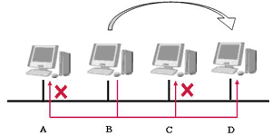
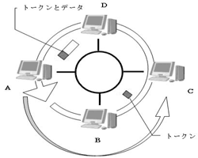
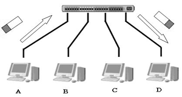

# TCP/IPの基礎

## データリンク

「データリンク」という言葉は、OSI参照モデルのデータリンク層を指す用語として使われる場合と、  
具体的な通信手段（イーサネット、無線LAN、MPLSなど）を指す一般的な用語として使われる場合がある。

TCP/IPでは、OSI参照モデルのデータリンク層以下（データリンク層と物理層）を定義していない。  
これらが透過的に機能していることを前提にしている。  
しかし、TCP/IPとネットワークの理解を深めるためにはデータリンクについての知識が重要となる。

### MACアドレス

MACアドレスはデータリンクに接続しているノードを識別するために利用される。  
イーサネットやFDDIでは、IEEE802.3で規格化されたMACアドレスが利用されている。  
それ以外にも、無線LANやBluetoothなどで同じ規格のMACアドレスが使われている。  
これは48ビットの長さを持ち、図に示すような構造を持つ。

このアドレスはネットワークインターフェースカード(NIC)のROMに書き込まれており、  
同じMACアドレスが付けられているNICは世界中で1つしかないことになっている。

MACアドレスの3~24ビットはベンダ識別子と呼ばれ、  
カードの製造メーカーごとに特定の数字が割り当てられている。  
25~48ビットはメーカーが製造したNICごとに違う数字を割り当てられる。
このようにして、世界で同じMACアドレスが設定されている製品は1つしかないことが保証される。

このIEEE802.3のMACアドレスは、データリンクの種類にかかわらずただ1つしかない値になるように割り当てられている。  
このためイーサネットやFDDI、ATM、無線LAN、Bluetoothなどデータリンクの種類が異なる場合でも、  
同じMACアドレスが割り当てられることはない。

#### ベンダ識別子

https://uic.jp/mac/

### 媒体共有型のネットワーク

通信媒体（通信、メディア）の使い方という観点から見ると、  
ネットワークは媒体共有型と媒体非共有型に分けることができる。

媒体共有型のネットワークとは、通信媒体を複数のノードで共有するネットワークである。  
イーサネットやFDDIは媒体共有型のネットワークである。  
この場合には、宛先のコンピュータを識別するのにアドレスが必要になる。  
このアドレスがMACアドレスである。  
この方式では、同じ通信路を使ってデータを送受信する制御も行う。  
そのため基本的には半二重通信となり、通信の優先権を制御する仕組みが必要になる。

### コンテンション方式

コンテンション方式とは、データの送信権を競争で奪い取る方式である。  
CSMA方式とも呼ばれる。  
各ステーションは、データを送信したくなったら、早い者勝ちで通信路を使用してデータを送信する。  
複数のステーションからデータが同時に送信された場合には、互いのデータが衝突し壊れてしまう。  
（この状態をコリジョンという）  
このため、ネットワークが混雑すると急激に性能が低下する。

このCSMA方式を改良したCSMA/CD方式がイーサネットで採用されている。  
CSMA/CDでは衝突を早期に検出して、素早く通信路を解放する制御が加えられている。

### トークンパッシング方式

トークンパッシング方式では、トークンと呼ばれるパケットを巡回させ、このトークンで送信権を制御する。  
トークンを持っているステーションだけがデータを送信することができる。  
この方式には、衝突が発生しないことと、誰にでも平等に送信権が回ってくるという特徴がある。  
このため、ネットワークが混雑しても性能があまり低下しない。  
その一方で、トークンが回ってくるまでデータを送信できないため、  
混雑していないときにデータリンクの性能を100%出せないように思われるかもしれない。  
そこで、アーリートークンリリース方式やアペンドトークン方式、複数のトークンを同時に巡回させるなどの技法により、できるだけ性能が向上するような工夫がされている。

### 媒体非共有型のネットワーク

通信媒体を共有せずに占有する方式で、ステーションはスイッチと呼ばれる装置に直接接続され、そのスイッチがフレームを転送する。  
この方式では、送受信の通信媒体が共有されないため、多くの場合、全二重通信となる。

最近のイーサネットは、イーサネットスイッチ等を用いてネットワークを構成することが多くなってきている。  
コンピュータとスイッチのポートが1対1に接続される場合には、  
イーサネットでも媒体非共有型のネットワークに近くなり全二重通信が可能になる。
1対1接続で全二重通信の場合にはコリジョンが発生しなくなるため、イーサネットであってもCSMA/CD
CD方式の機構が不要になり、より効率の良い通信ができるようになる。

この方式では、スイッチに高度な機能を持たせることにより、仮想的なネットワーク(VLAN)の構築やデータ流量の制御ができる。  
その反面、スイッチが故障するだけで接続された全てのコンピュータ間の通信が不可能になってしまうといった欠点もある。

### 参考

[マスタリングTCP/IP 入門編]

http://www9.plala.or.jp/lab-kage/tcpip/network_senddata.html