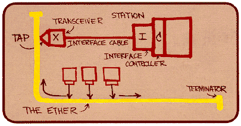
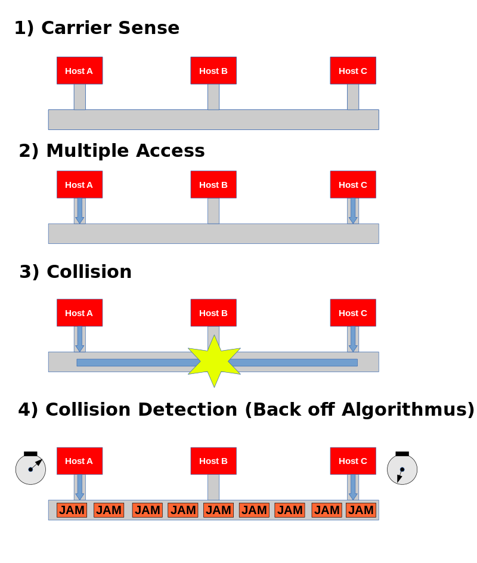
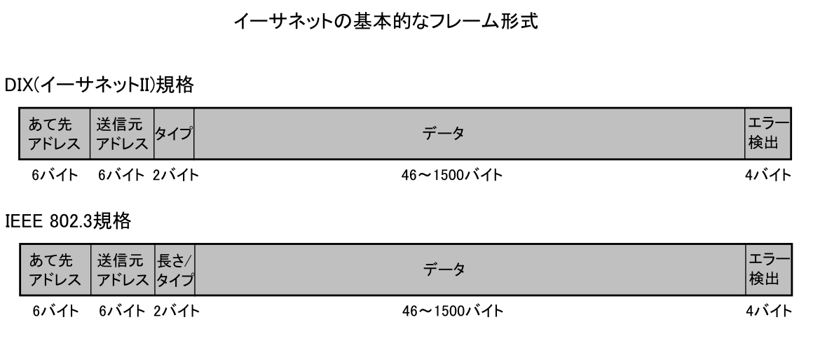
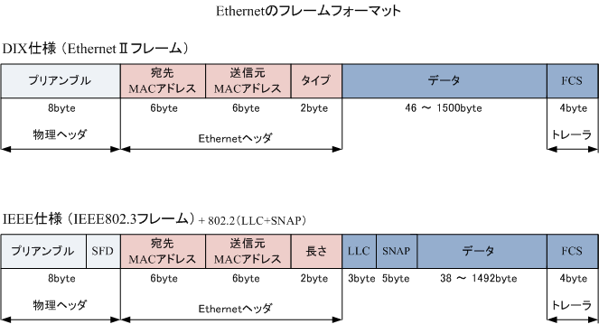
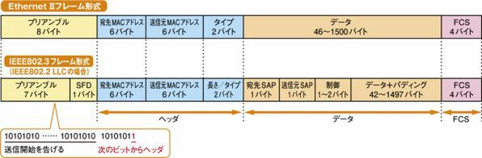

# TCP/IPの基礎

## データリンクその2

### イーサネット

データリンクの代表としては、現在最も普及しているイーサネットがある。  
他のデータリンクに比べて制御の仕組みが単純なため、NICやデバイスドライバが作りやすいという特徴がある。  
このような理由でイーサネットのNICは、他のNICよりも安い価格で販売されている。  
低価格で利用できたことが、イーサネットの普及に非常に大きな役割を果たした。

もともとはアメリカのXerox社とDEC社が考案した方式で、このときに"Ethernet"と命名された。  
ちなみにEthernetの語源はEther(エーテル：媒体)からきている。  
その後、IEEE802.3委員会によって規格化されたが、両者のイーサネットにはフレームのフォーマットに違いがある（後述）。  
そのため、IEEE802.3仕様のイーサネットのことを802.3 Ethernetと呼ぶことがある。  
逆に、普通のイーサネットのことをDEC, Intel, Xeroxの頭文字をとってDIX Ethernetと呼ぶこともある。

### イーサネットの種類

イーサネットには、通信ケーブルや通信速度が違う数多くの仕様がある。  
「10BASE-T」のような名称の頭の数字は伝送速度、後ろにつく文字は媒体の違いを示している。  
通信速度が同じで、通信ケーブルが違う場合は、  
それぞれの通信媒体を変換できるリピーターやハブなどで接続することができる。  
通信速度が違う場合には、速度変換機能を持つブリッジやスイッチングハブまたはルーターでなければ相互に接続することはできない。

### CSMA/CD方式

当初のイーサネットはバス型ネットワークを基本としていた。  
そしてバス型ネットワークでの通信に適したCSMA/CD方式が採用された。

- 搬送波が流れていなければ（データが流れていなければ）すべてのデータステーションはデータを送信してよい。(Carrier Sense Multiple Access)
- 衝突が発生したかどうかを検出し、衝突が発生した場合には送信をやり直す。(Collision Detection)

CSMA/CDは、半二重通信を前提とした方式だった。  
ツイストペアケーブルや光ファイバーケーブルとスイッチを利用した方式が現れ通信メディアを共有する必要がなくなると、半二重接続は不要と考えられるようになった。  
半二重通信に対応していない10ギガビットイーサネットではCSMA/CD方式は採用されていない。  
スイッチを使わない半二重の通信方式も、同軸ケーブルを使ったバス型の接続も現在はほとんど利用されなくなっている。

### イーサネットのフレームフォーマット

イーサネットのヘッダは、宛先MACアドレスのフィールドが6オクテット、  
送信元MACアドレスのフィールドが6オクテット、そしてタイプと呼ばれるフィールドが2オクテットの合計14オクテットからなる。  
フレームの末尾にはFCS(Frame Check Sequence)という4オクテットのフィールドがある。

宛先MACアドレスには宛先のノードのMACアドレスが格納される。  
送信元MACアドレスにはイーサネットフレームを作り出した送信元ノードのMACアドレスが格納される。  
タイプにはデータ部で運んでいるプロトコルを表す番号が格納される。  
つまり、イーサネットの上位層のプロトコルを示している。  
そして、データ部の先頭からは、タイプで示されたプロトコルのヘッダやデータが格納される。  
主なタイプとしては、IPは0800、ARPは0806、IPv6は86DDである。

最後のFCSは、フレームが壊れていないかどうかをチェックするためのフィールドである。  
通信中に電気的なノイズが発生すると、送信したフレームがビット化けを起こして壊れる可能性がある。  
このFCSの値をチェックすることで、ノイズによるエラーフレームを廃棄することができる。  
FCSには、フレーム全体を特定のビット列で割り、その余りを格納する。  
受信側でも同じ計算を行い、FCSの値が同じになったらフレームが正しく届いたと判断する。

### IEEE802.3 Ethernetのフレームフォーマット

IEEE802.3 Ethernetは通常のイーサネットとはフォーマットが異なる。  
タイプの部分が長さとなり、その後にLLCとSNAPというフィールドが続く。  
そして、このSNAPの中にプロトコルを表すタイプのフィールドがある。  
SNAPタイプの値は、イーサネットフレームのタイプとほぼ同じ意味になる。

通常のイーサネットとは、タイプ／フレーム長のフィールドが  
0000-05DC(10進数で1500)かそうでないかで区別することができる。

https://ja.wikipedia.org/wiki/%E3%82%A4%E3%83%BC%E3%82%B5%E3%83%8D%E3%83%83%E3%83%88 より

https://www.infraexpert.com/study/ethernet4.html より

https://ascii.jp/elem/000/000/427/427324/#eid427331 より

### 参考

[マスタリングTCP/IP 入門編]

https://www.iana.org/assignments/ethernet-numbers/ethernet-numbers.xhtml