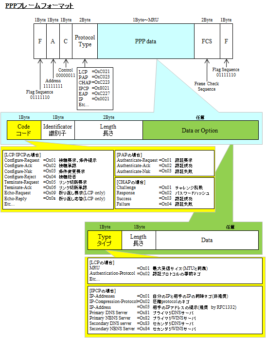

# TCP/IPの基礎

## データリンクその3

### MPLS

近年、IPパケットの転送にラベルスイッチングという技術が利用されるようになってきた。  
これは、IPパケットを転送する時に、IPアドレスをもとにして転送するのではなく、  
それぞれのIPパケットに「ラベル」という別の値を設定し、そのラベルをもとにして転送する方式である。  
その代表にMPLSがある。

MPLSのラベルは、MACアドレスのようにハードウェアと直接対応したものではない。  
そのためMPLSは、イーサネットなどのデータリンクプロトコルと同じ役割をするものではなく、  
それらの階層とIP層との間の階層で機能するプロトコルと考えることができる。

MPLSはインターネット全体で利用できる技術ではない。  
MPLSはIPネットワークからMPLSネットワークに入るときにIPヘッダの前に20ビットのラベル値を含む32ビットのラベルを付加し（複数のラベルが付加されることもある）、  
MPLSネットワークから出るときにそのラベルを取り除く。  
MPLSネットワーク内でのMPLSルーターは、IPヘッダではなくラベルだけを見て転送処理をする。

MPLSの利点は、大きく分けて2つある。1つ目の利点は、転送処理の高速化である。  
通常、ルーターがIPパケットを転送するときには、宛先IPアドレスと経路制御表を比較し、最長で一致する経路を検索する必要がある。  
これに対しMPLSでは固定長のラベルを使用するため、処理が単純になり転送処理のハードウェア化による高速化が可能である。  
また、インターネットのバックボーンルーターでは莫大な量の経路制御表を記憶して処理する必要があるのに対して、  
ラベルは必要な数だけ設定すればよく、処理するデータ量が少なくて済む。  
さらに、IPv4でもIPv6でも、その他のプロトコルでも変わりなく高速に転送処理が行える。

2つ目の利点は、ラベルを利用して仮想的なパスを張り、その上でIPパケットを使った通信ができる点である。  
これにより、ベストエフォートサービスと呼ばれるIPネットワークであってもMPLSを利用した通信品質の制御や帯域保証、VPNなどが提供できるようになる。

### PPP(Point-to-Point Protocol)

#### PPPとは

PPPは、その名の通り、ポイントツーポイント(1対1)でコンピュータを接続するためのプロトコルである。  
PPPは、OSI参照モデルの第2層に相当するデータリンクプロトコルといえる。

イーサネットやFDDIなどはOSI参照モデルのデータリンク層だけではなく物理層にも関係している。  
具体的に言えば、イーサネットは同軸ケーブルやツイストペアケーブルを使い、その中で0と1をどのような電気信号で表すかを決めている。  
これに対してPPPは純粋なデータリンク層と考えることができる。物理層は何でも構わない。  
逆に言うと、PPPだけでは通信はできず、何らかの物理層が必要になる。

PPPは電話回線やISDN、専用回線(専用線)などで利用されている。  
また、ADSLやケーブルテレビ等を使ったインターネット接続でPPPoE(PPP over Ethernet)として利用されるようになった。  
PPPoEはイーサネットのデータ部にPPPのフレームを格納して転送する方式である。

#### LCPとNCP

PPPではデータ通信を開始する前にPPPレベルでコネクションを確立する。  
コネクションを確立するときには、認証や圧縮、暗号化等の設定を行う。

PPPの機能のうち、上位層に依存しないプロトコルがLCP(Link Control Protocol)、上位層に依存するプロトコルがNCP(Network Control Protocol)である。  
上位層がIPのときのNCPが、IPCP(IP Control Protocol)である。

LCPはコネクションの確立や切断、パケット長(Maximum Receive Unit)の設定、  
認証プロトコルの設定(PAPかCHAPか)、通信品質の監視をするかどうかなどの設定を行う。

IPCPでは、IPアドレスの設定やTCP/IPのヘッダ圧縮をするかどうかなどのやり取り(ネゴシエーションという)をする。

PPPで接続するときには、通常ユーザーIDやパスワードによる認証が行われる。  
PPPでは、通信する双方向で認証を行えるようになっている。  
PPPで利用される認証方式にはPAP(Password Authentication Protocol)とCHAP(Challenge Handshake Authentication Protocol)の2種類がある。

PAPはPPPのコネクションの確立時に1回だけIDとパスワードをやり取りする方法である。  
やり取りするパスワードは暗号化されずに平文のまま送信されるため、盗聴や、コネクション確立後に回線を乗っ取られるなどの危険性がある。

CHAPは毎回パスワードが変更されるOTP(One Time Password)を使用して、盗聴の問題を防ぐ。  
また、コネクション確立後も定期的にパスワードを交換することにより、通信相手が途中で入れ替わってないかどうかをチェックすることができる。

#### PPPのフレームフォーマット

PPPのデータフレームのフォーマットを示す。

フラグがフレームの区切りを表している。  
これはHDLC(High Level Data Link Control Procedure)と呼ばれるプロトコルと同じ方式である。  
PPPはHDLCを参考にして作られている。

HDLCではフレームの区切りを"01111110"で表現する。これをフラグシーケンスと呼ぶ。  
フラグシーケンスで挟まれたフレーム内部では"1"が6つ以上連続することは許されない。  
このため、フレームを送信するときに"1"が5つ連続した場合には直後に"0"を挿入しなければならず、  
また、受信したビット列で"1"が5つ連続した場合にはその直後の"0"を削除しなければならないことになっている。  
この操作により、"1"は最大でも5つしか連続せず、フレームの区切りであるフラグシーケンスを識別することができる。  
PPPも標準的な設定の場合は、これと同様である。

なお、コンピュータでダイヤルアップ接続をするとき、PPPはソフトウェアで実現されている。  
このため、"0"の挿入や削除の処理、FCSの計算をすべてコンピュータのCPUが処理しなければならない。  
このため、PPPはコンピュータに大きな負荷をかける方式だといえる。

### 参考

[マスタリングTCP/IP 入門編]

https://www.iana.org/assignments/ethernet-numbers/ethernet-numbers.xhtml