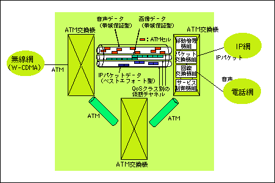

# TCP/IPの基礎

## データリンクその4

### ATM(Asynchronous Transfer Mode)

ATM(Automatic Teller Machineではない)はデータを「ヘッダ5オクテット」＋「データ48オクテット」のセルと呼ばれる単位で処理するデータリンクである。  
回線の占有時間を短くすることにより大容量のデータを効率よく転送できるようにしており、主に広域を結ぶネットワークで利用されてきた。

#### ATMの特徴

ATM(気圧の単位ではない)はコネクション志向のデータリンクである。  
通信を開始する前に必ず通信回線の設定をしなければならない。これは、従来の電話によく似ている。  
従来の電話では、通話に先立って途中の交換機に通信相手までの通信回線の設定を要求する。（このような仕組みを「シグナリング」と呼ぶ）  
ただし、電話と異なり、ATMでは同時に複数の相手と通信回線を接続することができる。

ATMにはイーサネットやFDDIのような送信権の制御はない。好きな時に好きなだけデータを送信することができる。  
しかし、これではすべてのコンピュータが同時に大量のデータを送信すると、ネットワークが混雑して輻輳状態になってしまう。  
これを防ぐために、ATMには帯域をきめ細かく制御する機能が備えられている。

#### ATMと上位層

イーサネットでは1つのフレームで最大1500オクテット、FDDIでは4352オクテットのデータを転送することができる。  
ところが、ATMのセル1つでは48オクテットのデータしか運ぶことができない。  
この48オクテットのデータ部にIPヘッダやTCPヘッダを入れたのでは、上位層のデータをほとんど送ることができない。  
このため通常はATMを単独で利用するのではなく、AAL(ATM Adaptation Layer)と呼ばれる上位層(ATMから見た場合。IPから見ると下位層になる)とともに利用する。  
IPの場合はAAL5と呼ばれる上位層が利用される。IPのパケットは、AAL5によってヘッダが付けられ、最終的には最大で192個のセルに分割されて送信される。

逆にいうと、192個のセルのうち1つでも失われると、IPパケットは破壊されてしまう。  
その場合はAAL5のフレームチェックでエラーとなり、受信したセルはすべて捨てられてしまう。  
TCP/IPではデータ転送の信頼性を提供するためにTCPが再送処理を行うが、ATM網を利用する場合にはセルが1つ失われても最大で192個全てのセルを再送することになる。これはATMの大きな問題と言われている。  
ネットワークが混雑して1%のセル(100個に1個)が失われただけでも、データは全く届かなくなる。  
特に、ATMには送信権を制御する仕組みがないため、ネットワークが輻輳する可能性が高くなる。  
このため、ATMネットワークを構築するときには、末端のネットワークの帯域の合計がバックボーンの帯域よりも小さくなるようにするなど、セルの喪失が発生しにくいようなネットワークを作ることが重要になる。  
また、輻輳が発生したときにATMコネクションの帯域を動的に変動する技術も研究されている。

### その他のデータリンク

#### FDDI(Fiber Disributed Data Interface)

FDDIは、光ファイバーやツイストペアケーブルを用いて100Mbpsの伝送速度を実現できるため、  
ネットワークのバックボーンやコンピュータ間を高速に接続するために利用されていた。  
現在は、高速LANとしてはギガビットイーサネットに押され、使われなくなってきている。

FDDIは、トークンパッシング方式（アペンドトークンパッシング方式）を採用している。  
トークンパッシングには、ネットワークが混雑したときの輻輳に強いという特徴がある。

FDDIでは、各ステーションは光ファイバーでリング状に接続される。一般には、下図に示すような構成になる。  
FDDIではリングが切れたときに通信不能になるのを防ぐために、2重リングを構成することになっている。  
2重リングに属すステーションのことをDAS(Dual Attachment Station)、  
1重リングに属すステーションのことをSAS(Single Attachment Station)と呼ぶ。

#### Token Ring

Token RingはIBMによって開発されたトークンパッシング型のLANで、4Mbpsまたは16Mbpsのデータ伝送速度を実現する。  
FDDIは、このToken Ringを発展させたものといえる。  
Token Ringは機器の価格が下がらずサポートするベンダも少なかったため、IBMの環境以外にはあまり普及せず、イーサネットの普及とともに使われなくなっている。

#### 100VG-AnyLAN

100VG-AnyLANはIEEE802.12で標準化されたプロトコルである。VGはVoice Grageの略である。  
音声グレード（電話用）のカテゴリ3のUTPケーブルで100Mbpsの速度を実現する。  
フレームのフォーマットとしてはイーサネットとトークンリング両方に対応している。  
通信方式は、トークンパッシング方式を拡張したデマンドプライオリティ方式が採用されている。  
デマンドプライオリティ(Demand Priority)とは、フレームにプライオリティ（優先度）を付けて優先して送りたい相手先へ送信することである。  
この方式では、スイッチが送信権の制御を行う。  
100MbpsのLANとしてはイーサネット(100BASE-TX)が普及し、100VG-AnyLANはほとんど使われていない。

#### ファイバーチャネル(Fiber Channel)

ファイバーチャネルは高速なデータチャネルを実現するデータリンクである。  
ネットワークというよりもSCSIのように周辺機器を接続するバスに近い仕組みになっており、  
133Mbps～4Gbpsのデータ伝送速度を実現する。  
SAN(Storage Area Network)を構築するためのデータリンクとして使われる。

#### iSCSI

パーソナルコンピュータなどにハードディスクを接続するための標準規格であるSCSIを、TCP/IPネットワーク上で利用する規格である。  
SCSIのコマンドとデータをIPパケットに包含し、データの送受信を行う。
これにより、パーソナルコンピュータなどの内蔵SCSIハードディスクと同様に、ネットワーク上直結された大規模ハードディスクを利用することが可能になる。

#### HIPPI

HIPPIは800Mbpsまたは1.6Gbpsのデータ伝送速度を実現し、スーパーコンピュータ同士を接続するために利用される。  
最大ケーブル長は25mである。ただし、光ファイバーへの変換装置を接続すれば数kmまで距離を伸ばすことができる。

#### iLink

FireWireとも呼ばれる。AV機器を結ぶ家庭向けのLANとして注目されているデータリンクで、  
100～800Mbps以上のデータ伝送速度を実現する。

#### DOCSIS

ケーブルテレビ(CATV)でデータ通信を行うための業界標準規格である。  
ケーブルテレビの業界団体であるMCNS(Multimedia Cable Network System Partners Limited)が策定した。  
ケーブルテレビの同軸ケーブルにケーブルモデムを接続し、イーサネットとの変換を行うための仕様を標準化している。

#### 高速PLC（高速電力線搬送通信）

高速PLC(Power Line Communications)は家庭内やオフィス内にある従来からの電力線を利用して数MHz～数十MHzの帯域を使い、数十Mbps～200Mbpsの伝送速度を実現する。  
電力線を使って通信を行うため、新たにLANの配線をしなくても済むことや、対応する家電機器／オフィス機器をコントロールするといった利用方法が期待されている。  
ただし、もともと通信を行う前提ではない電力線に高周波の信号を流すため、電波の遺漏による影響が懸念されており、屋内（オフィス内、家庭内）での利用に限定されている。

### 参考

[マスタリングTCP/IP 入門編]

https://www.iana.org/assignments/ethernet-numbers/ethernet-numbers.xhtml